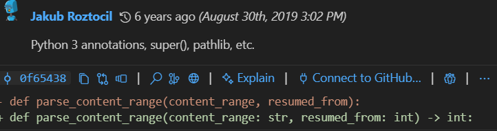

# GitLens Insights

## Function Investigated

**Function:** `parse_content_range()`  
**Location:** `httpie/downloads.py`  
**Author:** Jakub Roztocil  
**Date Last Updated:** August 30, 2019  
**Commit Hash:** `0f65438`  
**Commit Message:** Python 3 annotations, super(), pathlib, etc.

## Screenshot

